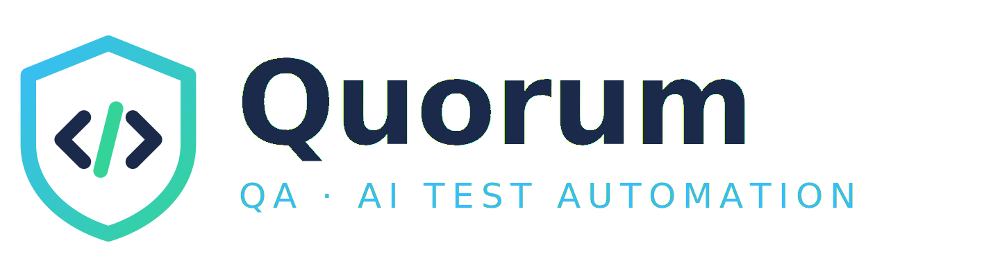

<p align="center">
  <picture>
    <source media="(prefers-color-scheme: dark)" srcset="quorum_logo_escuro.png">
    
  </picture>
</p>

<p align="center"><b>QA · AI Test Automation</b></p>

<p align="center">
  <a href="https://github.com/LJCGJ/Quorum.Studio/actions/workflows/build.yml"></a>
  <a href="https://www.gnu.org/licenses/gpl-3.0"></a>
  
  
  
</p>

---

Quorum e uma ferramenta desktop **livre e multiplataforma** de automacao de testes e
seguranca guiada por IA. Voce descreve em linguagem natural o que quer testar e um
agente executa ao vivo via **Model Context Protocol (MCP)** — dirige um navegador
real, consulta um banco de dados ou chama uma API — depois relata o que encontrou e
gera um script reutilizavel.

O diferencial esta no nome: o Quorum **orquestra Claude, OpenAI e Gemini em conjunto**.
Um roteador escolhe o provedor e o modelo adequados a cada tarefa, troca de IA sozinho
quando uma falha, e — se voce pedir — chama uma **segunda IA para revisar criticamente**
o resultado da primeira.

## O que ele faz

**Automacao de testes, executada de verdade**
- **Teste de tela** — dirige um navegador real via Playwright MCP, observando o estado
  da pagina antes de cada acao
- **Teste de API** — monta e dispara requisicoes HTTP e analisa status, cabecalhos e corpo
- **Banco de dados** — explora o schema e consulta PostgreSQL, MySQL, MariaDB, SQLite e
  SQL Server (via DBHub MCP) ou MongoDB (servidor MCP oficial), em **somente leitura por padrao**

**Orquestracao multi-IA**
- roteamento por tarefa: conversa vai para um modelo rapido e barato; automacao com
  ferramentas, para um equilibrado; analise longa, para o de maior contexto
- **fallback automatico** entre provedores quando um falha por cota, rede ou chave
- **varias tarefas ao mesmo tempo**, cada uma com seu modelo, progresso e cancelamento
- **revisao opcional**: uma segunda IA (de outro provedor, quando disponivel) le e
  critica o relatorio da primeira

**Controle de custo, porque tokens custam dinheiro**
- modo economia: sempre o modelo mais barato que atende a tarefa
- tokens e passos exibidos por tarefa, e a revisao contabilizada a parte
- teto de passos por tarefa e de tarefas simultaneas
- lista de modelos buscada **direto no provedor** — modelo aposentado some sozinho

**O que voce leva embora**
- **script extraido** do relatorio e salvo com a extensao certa (.py, .robot, .sql...)
- **relatorio HTML** com ficha (data, operador, modelo, tokens) e o codigo destacado

## Como rodar

Requisitos: [.NET 8 SDK](https://dotnet.microsoft.com/download) (ou superior) e, para as
automacoes que usam MCP, [Node.js 18+](https://nodejs.org).

### Sistemas suportados

| Sistema | Versoes |
|---|---|
| **Windows** | 10 (build 1607+) e 11 — x64 |
| **Linux** | Ubuntu 20.04+, Debian 11+, Fedora, openSUSE 15+, RHEL 8+ — com ambiente grafico (X11/Wayland) |
| **macOS** | 12 Monterey ou superior — Intel e Apple Silicon |

Os limites vem do .NET 8, que o aplicativo carrega embutido no instalador. Sistemas
anteriores (Windows XP/7/8, macOS Lion a Big Sur) nao conseguem executar o runtime.

```bash
git clone https://github.com/LJCGJ/Quorum.Studio.git
cd Quorum.Studio
dotnet build
dotnet test
dotnet run --project src/Quorum.App
```

Depois de abrir: cadastre uma chave de API em **Configuracoes** (o provedor e
reconhecido pelo formato da chave), va em **Modelos** e clique em *Atualizar lista no
provedor* — isso valida a chave sem consumir tokens.

### Conferir o ambiente antes de gastar creditos

```bash
dotnet run --project tools/Quorum.McpSmokeTest
```

Sobe um servidor MCP real, lista as ferramentas e executa uma chamada. Nao usa IA nem
chave de API: **custo zero**. Serve para confirmar que Node, npx e o protocolo estao
operacionais antes de qualquer automacao paga.

## Arquitetura

```
Quorum.Studio.sln
├── src/Quorum.Core        dominio puro: modelos, roteador multi-IA, contratos de IA,
│                          extracao de scripts e geracao de relatorio (sem IO)
├── src/Quorum.Providers   Claude · OpenAI · Gemini sobre IChatClient, num adaptador
│                          unico; busca dinamica do catalogo de modelos
├── src/Quorum.Agents      loop agentic unico, classificacao de falhas, fallback entre
│                          modelos, agente de API e execucao simultanea de sessoes
├── src/Quorum.Mcp         cliente MCP (Playwright · DBHub · MongoDB) e os agentes
│                          de tela e banco
├── src/Quorum.Security    cofre de chaves (DPAPI no Windows; permissoes no restante)
├── src/Quorum.App         interface Avalonia (MVVM): Chat · Automacao · Modelos ·
│                          Configuracoes
├── tests/Quorum.Tests     suite xUnit — roda sem chave de API, sem rede e sem Node
└── tools/Quorum.McpSmokeTest   verificacao de ambiente, custo zero
```

Duas escolhas explicam o resto do desenho:

**O `Quorum.Core` nao depende de ninguem.** O roteador e uma funcao pura, os agentes
falam com interfaces, e o cliente MCP tem uma abstracao de sessao. Por isso a suite
inteira roda de graca: provedores de IA sao substituidos por dublês roteirizados, HTTP
por um handler falso e o servidor MCP por uma sessao falsa. O CI valida nos tres
sistemas operacionais sem uma chave de API sequer.

**Um loop agentic, nao um por provedor.** A conversacao com a IA (pedir ferramenta,
executar, devolver resultado, repetir) vive num lugar so e serve a qualquer provedor e
qualquer agente. Esse era o ponto onde a versao anterior deste projeto acumulava
divergencias entre as tres IAs.

Detalhes de decisao estao em [Quorum_Arquitetura.md](Quorum_Arquitetura.md).

## Estado do projeto

Funcionalmente completo e coberto por testes. **A validacao de ponta a ponta com
creditos reais ainda nao foi feita** — ate la, considere as automacoes verificadas por
teste automatizado, e nao por uso em producao.

## Licenca

GNU General Public License v3.0 — veja [LICENSE](LICENSE). Derivados distribuidos devem
permanecer abertos sob a GPL.

## Autor

**Leonardo Gonzaga** — QA automation engineer · [@LJCGJ](https://github.com/LJCGJ)
