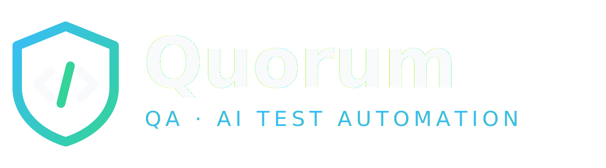

<p align="center">
  
</p>

<p align="center"><b>QA · AI Test Automation</b></p>

<p align="center">
  <a href="https://www.gnu.org/licenses/gpl-3.0"></a>
  
  
  
</p>

---

Quorum e uma ferramenta desktop **livre e multiplataforma** de automacao de testes
e seguranca guiada por IA. Voce descreve o que quer testar em linguagem natural e
um agente executa ao vivo via **Model Context Protocol (MCP)** — dirige um navegador
real, consulta um banco ou chama uma API — depois relata o que encontrou e gera um
script reutilizavel.

O diferencial: Quorum **orquestra Claude, Gemini e OpenAI em conjunto**. Um roteador
escolhe o provedor e o modelo certos para cada tarefa (conversa barata, automacao
com ferramentas, analise de contexto longo), com fallback automatico entre provedores.

> **Status:** em desenvolvimento. Reescrita profissional do T2M Security Manager,
> agora em C# / .NET 8 + Avalonia, rodando nativamente em Windows, Linux e macOS.

## Arquitetura

```
Quorum.sln
├── src/Quorum.Core       dominio: modelos, registro, roteador multi-IA (sem IO)
├── src/Quorum.Providers   Claude · OpenAI · Gemini            (a construir)
├── src/Quorum.Mcp        cliente MCP (Playwright/DBHub/Mongo)  (a construir)
├── src/Quorum.Agents     loops agentic: Tela · API · Banco     (a construir)
├── src/Quorum.Security   cofre de credenciais multiplataforma  (a construir)
├── src/Quorum.App        interface Avalonia (MVVM)             (a construir)
└── tests/Quorum.Tests    xUnit — valida a logica sem gastar creditos de IA
```

O `Quorum.Core` nao depende de ninguem, entao o roteador e os agentes sao
testaveis sem chamar IA de verdade — a suite roda de graca no CI.

## Build

```bash
dotnet build
dotnet test
```

## Licenca

GNU General Public License v3.0 — veja [LICENSE](LICENSE). Derivados distribuidos
devem permanecer abertos sob a GPL.

## Autor

**Leonardo Gonzaga** — QA automation engineer · [@LJCGJ](https://github.com/LJCGJ)
